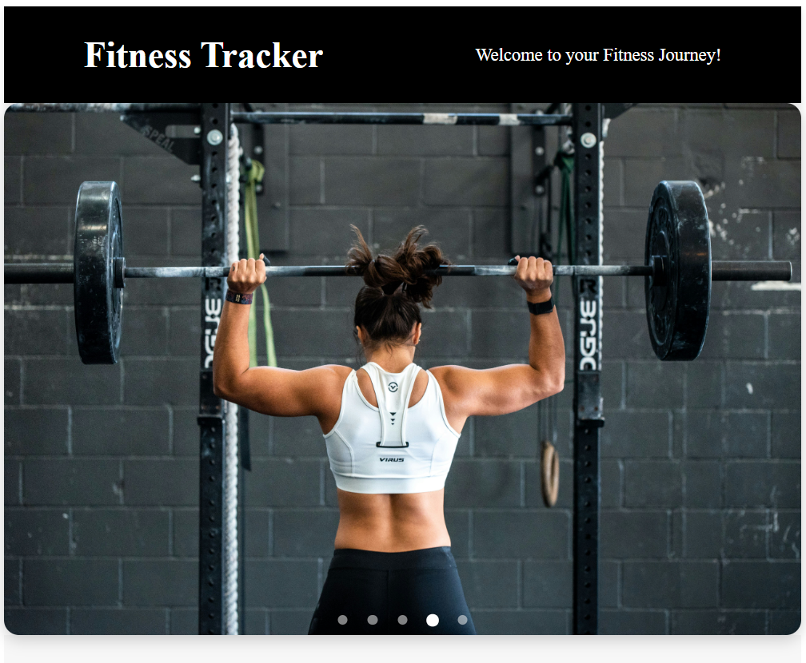
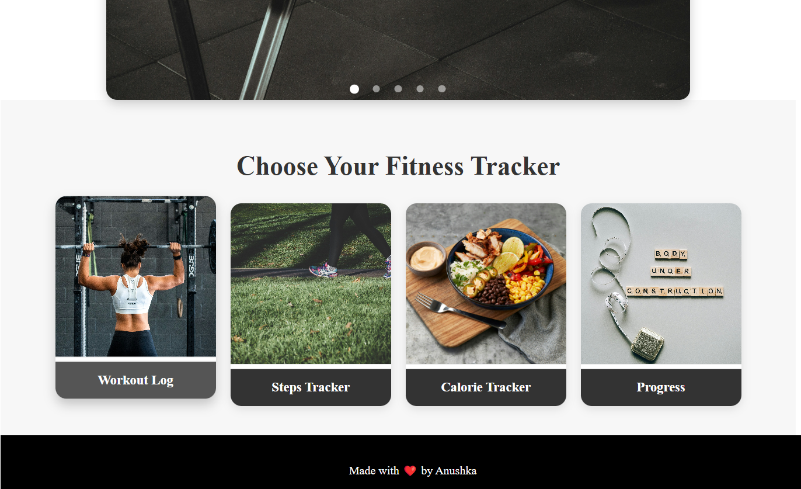
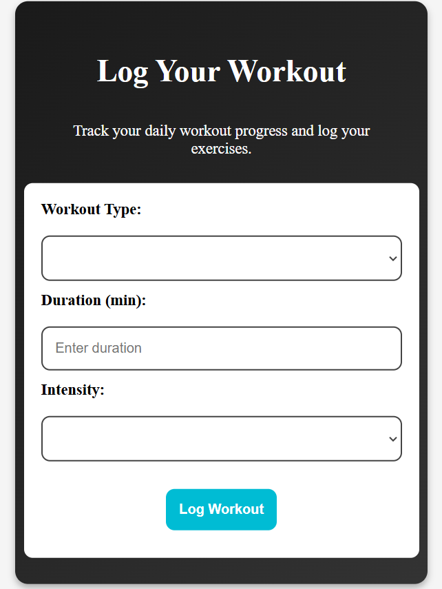
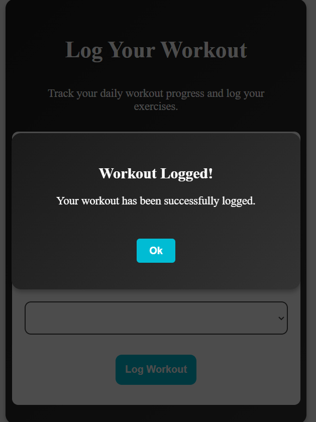
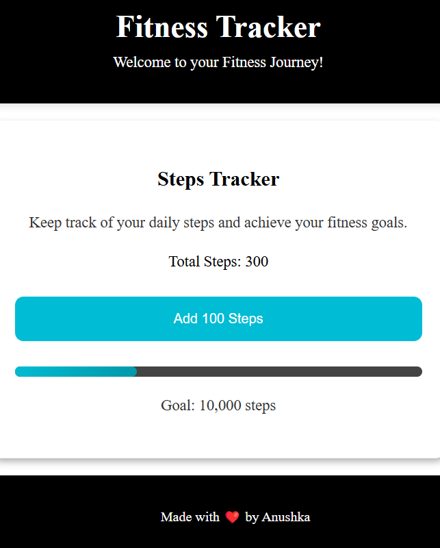
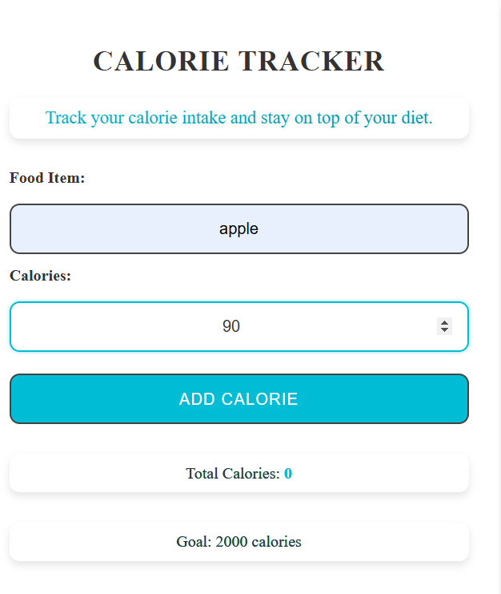
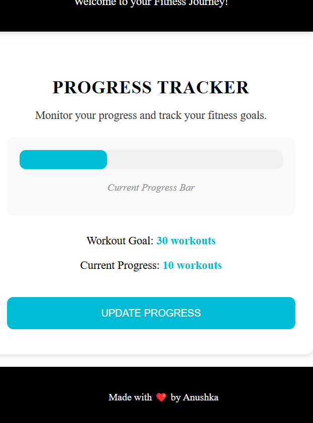

## Fitness Tracker App
This is a fitness tracker application built with Angular to help users track their workouts, steps, and calories. 

## Features:
Workout Log: Log workout type, duration, and intensity (medium, light, or high). A popup appears after logging.

Steps Tracker: Track the number of steps and set goals.

Calorie Tracker: Add food items and their calorie count, and check total calorie intake.

Progress: Monitor progress toward your fitness goals.

